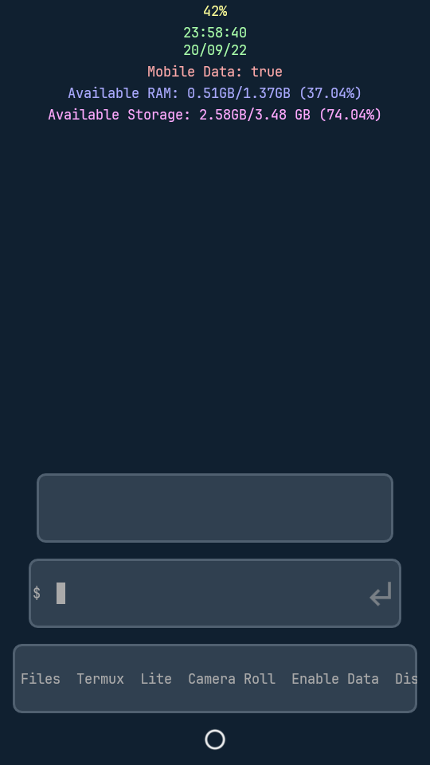
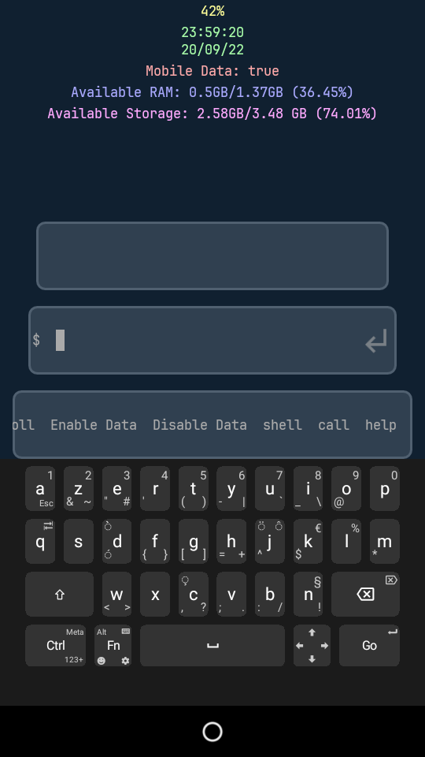
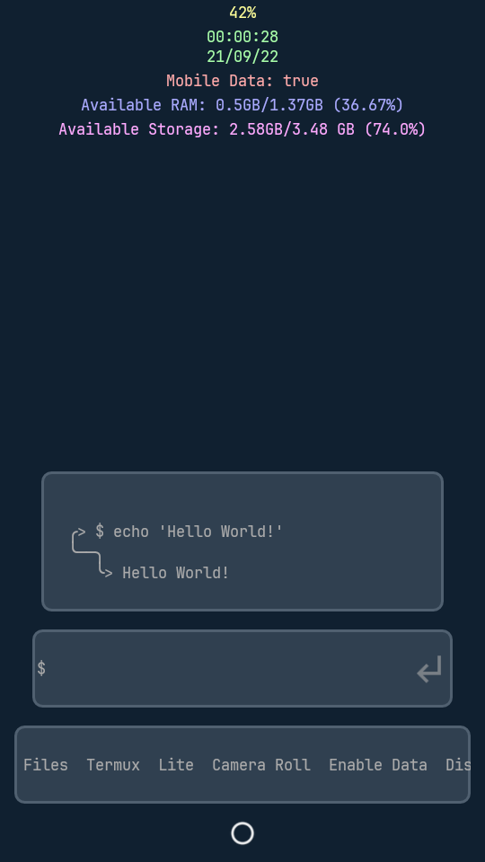

# Chad-T-UI 😎
Pretty theme for T-UI with additional features.

# Features 🍲
- Double tap to reveal status bar (root).
- Enable/disable data (root).
- Pleasant theme to look at.
- Termux shell (root).
- Eye-freindly.

# Screenshots 🤳

# Credits 💙
- <a href="https://github.com/fAndreuzzi">T-UI</a> creator for this amazing launcher.
- <a href="https://github.com/JetBrains">JetBrains</a> for their awesome font.
